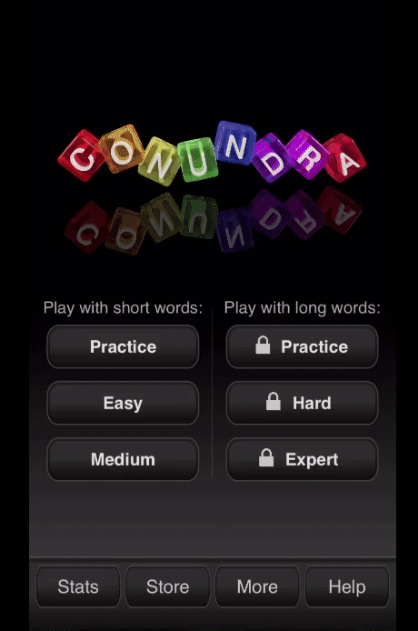
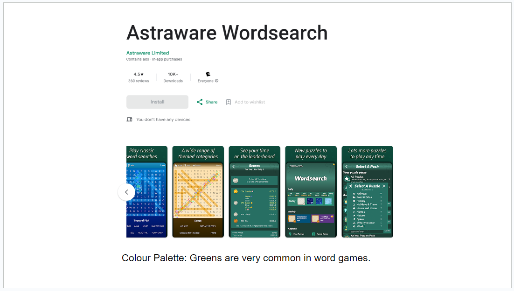

# Animal Scramble Word Game

<br>
<p align="center" width="100%">
    
</p>
<br>

[Animal Scramble](https://jeskodes.github.io/word-scramble/) is an anagram game where the player has to unscramble the jumbled up animal words.
The game has been designed to be quick to start with obvious game play and few explanations.

The target players are people of all ages who are looking to distract themselves for a few minutes with a lighthearted word game.

Play [Animal Scramble!](https://jeskodes.github.io/word-scramble/)

## Design

### Research

#### Features Research

The original idea for the project came from my enjoyment of anagram and code word games. The Conundra app is great to play to pass the
time, especially while waiting for appointments or travelling. I wanted to develop something more basic, but similar to Conundra.

<br>
<p align="center" width="100%">
    
</p>
<br>

Features of Conundra:

- Select three different levels: Practice, Easy, Hard.
- Gameplay: Buttons to scramble the word again, pass, start again. Scoreboard at the end showing correct and incorrect guesses.

#### Design Research

- I researched word game apps for layout and colour palette ideas.
- The main findings were that the apps used two - three colours, usually one being white, and green was a common main colour.
- Astra Wordsearch and Wordle-type games are two examples:

<br>
<p align="center" width="100%">
    
</p>
<br>
<br>
<p align="center" width="100%">
    
</p>
<br>

##### Tutorial Research and Development:

I searched for JavaScript word scramble tutorials to develop my knowlege of JavaScript and which included the basic features I wanted to include in the game.

A large part of the functionality of Animal Scramble is based on a tutorial by Laurence Svekis: [JavaScript Create 5 Fun Word Games by Laurence Svekis](https://www.udemy.com/course/javascript-games/learn/lecture/22686281?start=120#content). Additions, deletions, substitutions and changes are noted in the code.

##### Word Scramble by Laurence Svekis - Final Game Play

<br>
<p align = "center" style="background-color: gray">
  
</p>
</br>

I also referred to two similar tutorials by [CodingNepal.](https://www.youtube.com/watch?v=4-s3g_fU7Vg&t=992s)

##### Word Scramble by CodingNepal - Final Game Play

<br>
<p align = "center">
   
</p>
</br>

### Design

- A minimally cluttered container which the user can pick up and play almost immediately.
- Intuitive game play: minimal text on the page and only a few instructions needed to understand game play.
- Slight use of border-radius for container, buttons and input box.
- Typeface: Serif font for labels such as name of game, buttons - slightly 70's style; used [google fonts](https://fonts.google.com/)
  Patua One. Sans-serif font for input box and displaying correct word; used [google fonts](https://fonts.google.com/) Roboto.
- Colour Palette: Despite research that word games tend to use a more muted colour palette with an emphasis on greens and white, the Animal Scramble game is targeted at users of all ages from 10yrs upwards. Animal Scramble's aim is to be lighthearted and fun. Therefore a more brightly coloured, retro theme and typeface was chosen with a colour palette to reflect this:

<br>
<p align = "center">
  
</p>
</br>

<br>
<p align = "center">
  
</p>
</br>

#### Wireframes

<br>
<p align="center" width="100%">
    
</p>
<br>

#### Wireframes
- Starting from a desktop first approach. 
- Main gameplay in a fixed sized <div> container; media queries will be applied if needed for tablet and mobile. 
- Three different displays of content controlled with JavaScript: 
  - Start Page
  - Game Play
  - Game Over

## User Stories and Features

#### User Story 1:

1. As a child of approximately 8 - 13yrs who likes word games.
2. I want a quick game to keep me occupied.
3. So that I can test my skills and won't get bored travelling or waiting.

#### User Story 2:

1. As an adult who enjoys word games.
2. I want a quick game that will challenge me and keep me occupied.
3. So that I can relax with an engaging challenge.

#### User Story 3:

1. As an adult who enjoys word games.
2. I want a quick game that will challenge me and keep me occupied.
3. So that I can pass the time while waiting or travelling.

#### User Story 4:

1. As an older adult who enjoys word games and is retired.
2. I want a quick game that will challenge me.
3. So that I can keep my mind sharp.

##### User Steps:

- General search: SEO tags - brain-training, conundrum, letters and words, anagram, game, guessing, words, scramble, animals.

- Easily open the app/webpage and play Animal Scramble straight away. The design communicates how to play without the need for lots of explanations.

##### Minimum Viable Product: Features and Acceptance Criteria:

- Single page.
- The user first arrives at the game title and game play.
- Start Button.
- Input box for guessing the word.
- Answer: The correct answer is always shown after the guess, whether the uses guesses correctly or incorrectly.
- Next Button for next word.
- A way to skip a guess.
- A restart button to start a new game.
- Scoring.
- Accessibility: Tab controls can be used to play the game.

## Technologies Used

- JavaScript, HTML and CSS.
- VScode - Coding Editor.
- Chrome Dev tools
- [Google Fonts.](https://fonts.google.com/)
- [Favicon Icons](https://favicon.io)
- [fontawesome](https://fontawesome.com/) for social media icons.
- [github](https://github.com/) version control.
- [Repl:it](https://replit.com/) for experimenting with code.
- [Axe dev tools](https://www.deque.com/axe/devtools/) to test accessibility.
- [Webaim](https://wave.webaim.org/) WCAG Contrast checker.
- [W3C CSS Validation Service](https://wave.webaim.org/) to validate css.
- [W3C Markup Validation Service](https://validator.w3.org/#validate_by_input) to validate html.
- [JSON Formatter - Convert Array to JSON](https://jsonformatter.curiousconcept.com/#)
- [Validating JSON Object: jsonlint.com](https://jsonlint.com/)
- [JavaScript Linting: jshint.com](https://jshint.com/)
- [Convert mp4 to gif using ezgif.com](https://ezgif.com/)

## Current Features

<br>
<p align="center" width="100%">
    
</p>
<br>

### Main Game Area
- Background image covers entire screen. 
- One main section with fixed div container for whole game. 
- Footer with link to [github profile](https://github.com/jeskodes).

#### Start Game
- Title 
- Rules
- Start button
<br>
<p align="center" width="100%">
    
</p>
<br>

#### Game Play
- Title
- Dynamic Scoreboard
- Scrambled word
- Input box to type in guess.
- Placeholder text in textarea "Enter to Skip". 
- Restart button
<br>
<p align="center" width="100%">
    
</p>
<br>

Make a guess, then
- Title
- Scrambled word unscrambles with correct or incorrect guess. 
- Scrambled word background goes blue for correct or pink for incorrect. 
- Button "Click for Next Word"
- Restart button.
- <br>
<p align="center" width="100%">
    
</p>
<br>

After 5 guesses (correct or incorrect) then
- Game Over
- Score
- Restart button.
<br>
<p align="center" width="100%">
    
</p>
<br>

#### Restart Button
- Reloads page. 
- Animation used to smooth transition. 

#### Buttons
- :hover used to change color. 
- cursor pointer added. 

### Features for Future Versions:

- Fix accessibility issue so can use tab controls to play game.
- Add to Json File and create levels of difficulty, Easy, Medium, Hard. 
- Add additional categories, e.g. Food, Countries, Actions. 
- Add buttons to choose difficulty level. 
- Store the 5 words per game in a temporary array and create scoreboard at end showing correct and incorrect words. 
- Best of 5 games then final score. 
- Timer.
- Split scrambled word into individual tiles. 
- More celebratory and dynamic "Game Over" or "You Won". 

## Testing

### BUGS

#### Accessibility Bugs

**BUG**
- The player is using tab controls.
- The player presses "Enter" to play the game and for the next word.
- The winChecker() function - which checks if the words match - immediately checks the word and the player cannot make a guess. The game cannot be played without using the mouse.

<br>
<p align = "center">
  
</p>
</br>

**Fixes**

1. Make input textbox visible throughout. This resulted in two further bugs: - The target word persisted and any press on “Enter” resulted in getting an infinite number of correct scores on the same correct guess. - The input (inWord) could be displayed but was disabled.
<p align = "center">
  
</p>

2. Added eventListener to stop default behaviour when pressing Enter - did not fix(removed).
3. Separated out functions to create a separate function after winChecker().
4. Added `btn.onfocus();` after function checked if words matched - this worked to automatically focus on the button but did not fix the bug.

**Result**
- Unable to fix the bug. This would be targeted in later versions with a separate function at the point of refreshing the scrambled word. 
It is disappointing that Animal Scramble V1 is not accessible using tab controls.

#### Game Play General Bugs 
**BUG** 
- The output(myWordsFromJson) does not unscramble the target word, even if they guess incorrectly so the player won't know what the right answer was; this could cause the player frustration. 

**Fix**
 - Add line of code to winChecker() fucntion - both correct and incorrect guesses: 

 <br>
<p align = "center">
  
</p>
</br>


 **BUG**
 - Gameplay does not stop at 5 turns and can play an infinite amout of times if keep guessing incorrectly. 

  <br>
<p align = "center">
  
</p>
</br>


 **Fix**
 -Create maxGuesses variable to count guesses and add to gamePlay() function; stop play at 5 guesses.  


```javascript 

function gamePlay() {
  if (myWordsFromJson.length <= 0 || maxGuesses === 5) {
    //EDIT: Add in "or" maxGuesses for game over.
    console.log("game over");
    console.log(maxGuesses);`
    
```

**BUG**
- Game play stops at 5 turns but the player has no way to play again unless they refresh the page. 

**Fix**
- Add restart-btn. 

```javascript
const restart = document.createElement("button");
```

- Add EventListener to restart button to refresh page when clicked. 

```javascript
restart.addEventListener("click", (e) => {
  window.location.reload();
});
```

**BUG**
- When refresh page the transition is jerky. 

**Fix**
- Add CSS animation to start of game to mask. 

**BUG**
- User testing reported that on android there was no way to press "Enter" to skip; the "go" button did not work. 

**Fix**

- Added EventListener for pressing "go" when focus on input box = carry out winChecker function. 

```javascript

inWord.addEventListener("keyup", (e) => {
  console.log(e);
  if (inWord.value.length === game.sel.length || e.key === "Enter") {
    winChecker(); //run the winChecker function
  }
});

```

#### Textbox Specific Bugs

**BUG**
- Initially used four animal words in array inside script.js to scramble; the words were four letters in lenght or shorter. 
- Added much big array of animal words to separate js file and the text went outside of input and output boxes. 

**Fix**
- Added classes to inWord(textbox) and myWordsFromJson (scrambled words) and styled with CSS. 
- Additionally added classes to start and refresh buttons in order to style in CSS. 

**BUG**
- User testing on ios reported that the game was showing an incorrect response as correct. 
- Investigation revealed that the words were being autocorrected across multiple devices. 
- Investigation with DevTools showed correct guess in console log as incorrect: 


<p align = "center">
  
</p>

**Fix**
- Add autocomplete = "off" spellcheck = "false" to input html. 

```html

<section class = "game-play">
  <div id="game-area">
    <h1 id="heading-wordscramble">Animal Scramble</h1>
      <input type="text" class ="input-text" id = "input-word" name = "inputtext" autocomplete = "off" spellcheck = "false" autocomplete = "off" placeholder = 'Press Enter to Skip' aria-label="Type word here" 

```


**BUG**

- Can enter numbers and special characters into input box. 

**Fix**
- Add JavaScript code snippet to html to only allow letters. 

```javascript 

      onkeypress="return (event.charCode > 64 && 
	    event.charCode < 91) || (event.charCode > 96 && event.charCode < 123)"
      
```

**BUG**

- Input box is case sensitive and counting guesses in lowercase and caps as wrong. 

**Fix**

- Add toLowerCase() to winChecker() function. 

```javascript

function winChecker() {
  if (inWord.value.toLowerCase() == game.sel) {
    //EDIT: added .toLowerCase()
    
```
### Verification

### Responsiveness

  <br>
<p align = "center">
  
</p>
</br>

[Animal Scramble](https://jeskodes.github.io/word-scramble/) is responsive across a large range of devices. There are no media queries needed as:
-  The main game container div is set at a fixed size using rem.
-  The input box, buttons and output div are also set to a fixed size using rem so the format does not break when resized. 
- Responsiveness was tested using Chrome DevTools, [Responsivedesignchecker.com](https://responsivedesignchecker.com), and user testing on Android Phone, ios ipad air 2, iphone SE 2020, iphone 10, windows laptop 1600 x 1200.

---

### Axe Chrome DevTools and WebAIM Contrast Checker

- No issues raised. 
  <br>
<p align = "center">
  
</p>
</br>

---

## Validator Testing

### JSHint Validator

There were no warnings or errors when passed through the [JSHint](https://jshint.com/) validator. 

<br>
<p align = "center">
  
</p>
</br>

### W3C CSS Validation Service

The [W3C CSS Validation Service](https://jigsaw.w3.org/css-validator/#validate_by_input) found no errors. 

### W3C Markup Validation Service

##### The [W3C Markup Validation Service](https://validator.w3.org/#validate_by_input) was used to validate the HTML.

The HTML passed with no warnings or errors to show following minor fixes, such as an unclosed <div>, a quotation mark the wrong way round in the meta data and two duplicate attributes. 

---

## Deployment

[Animal Scramble](https://jeskodes.github.io/word-scramble/) was deployed using git, github and vscode.

## Credits

- [JavaScript Create 5 Fun Word Games by Laurence Svekis](https://www.udemy.com/course/javascript-games/learn/lecture/22686281?start=120#content)
- [Word Scramble Game Youtube Tutorial by Coding Nepal](https://www.youtube.com/watch?v=4-s3g_fU7Vg&t=992s)
- [Word Scramble Game Tutorial by Coding Nepal](https://www.codingnepalweb.com/word-scramble-game-html-javascript/)

- [Youtube Tutorial: 3 Ways to code Rock Paper Scissors with Ania Kubow](https://www.youtube.com/watch?v=RwFeg0cEZvQ)

- [Git Hub Repo - Learning how to add reset button and replay](https://github.com/mariaalouisaa/pokemon-top-trumps/blob/main/index.html)

- [Tic Tac Toe Tutorial - Research how to refresh game](https://www.youtube.com/watch?v=JsErMawwdOw)

- [W3 Explanation of keyboard and mouse events: w3.org](https://www.w3.org/WAI/GL/WCAG20/WD-WCAG20-TECHS-20071102/SCR20.html)

- [JavaScript Keyboard Events Tutorial: the keyup and keydown Event Listeners](https://www.youtube.com/watch?v=OiYmhhe6Inc)

- [Youtube Tutorial Event Handlers and Event Listeners](https://www.youtube.com/watch?v=xogpUfUL5kY)

- [Tutorial Listening to Multiple Events in Vanilla JS](https://gomakethings.com/listening-to-multiple-events-in-vanilla-js/)

- [Animals Array](https://gist.github.com/borlaym/585e2e09dd6abd9b0d0a)

- [Colour Palettes and Hex Codes: coolor.co](https://coolors.co/)

- [Background Image from iStockPhoto.com](https://www.istockphoto.com/)

- [Make Reload of Page Smoother with CSS Animation and @keyframes: geeksforgeeks.org](https://www.geeksforgeeks.org/how-to-create-fade-in-effect-on-page-load-using-css/)

- [JSON Formatter - Convert Array to JSON](https://jsonformatter.curiousconcept.com/#)

- [Create new button from tutorial: www.3schools.in](<https://www.3schools.in/2022/08/how-to-create-button-with-id-js.html#:~:text=Use%20the%20createElement()%20method%20and%20set%20in%20a%20variable,an%20id%20to%20that%20button>)

- [Hex Colors from Background Image: imagecolorpicker.com](https://imagecolorpicker.com/)

- [Validating JSON Object: jsonlint.com](https://jsonlint.com/)

- [Favicon Icons: favicon.io](favicon.io)

- [JavaScript Linting: jshint.com](https://jshint.com/)

- [Convert mp4 to gif using ezgif.com](https://ezgif.com/)

- [Center align an img in README.md from stack overflow](https://stackoverflow.com/questions/12090472/how-do-i-center-an-image-in-the-readme-md-file-on-github/62383408#62383408)

- [Video Bugs and Functionality Using Bandicam.com](https://www.bandicam.com/)
